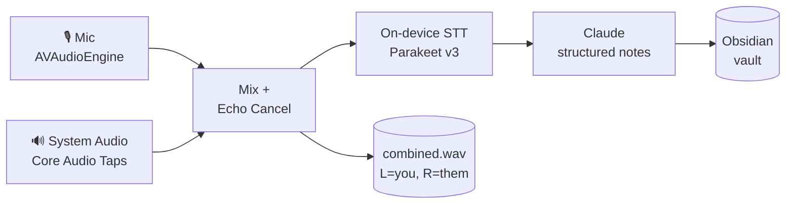

<div align="center">


# Hlopya

**Local-first meeting recorder for macOS.**
Records your calls, transcribes them on-device, and writes the notes for you.

[](https://github.com/VCasecnikovs/hlopya/releases)
[](https://www.apple.com/macos)
[](https://github.com/VCasecnikovs/hlopya/releases)
[](https://swift.org)

[Download](https://github.com/VCasecnikovs/hlopya/releases/latest) · [Build from source](#build-from-source) · [How it works](#how-it-works)

</div>

---

<div align="center">
  
  <p><sub>Diarized transcript at the bottom (<b>Me</b> vs <b>Them</b>, every line timestamped). Claude-structured notes on top — in whatever language the call was in.</sub></p>
</div>

## Why Hlopya

Granola is great. Until you're on a Russian call. Or German. Or Polish. Or your laptop is in airplane mode. Or you don't want a third-party server holding your client conversations.

Hlopya is the local alternative.

- 🎙️ **Records both sides.** System audio via Core Audio Taps + your mic via AVAudioEngine. No virtual cable hacks.
- 🌍 **Multilingual transcription that actually works.** Built on NVIDIA Parakeet v3 — trained on 25 European languages. In our internal tests it outperforms Whisper-large on Russian, German, Polish, French, Spanish, and Italian — the languages where most "AI notetakers" silently fall apart.
- 🔒 **Everything stays on your Mac.** Audio + transcription never leave the device. AI notes are the only step that calls out (your Claude API key, your bill).
- ⚡ **Auto-records calls.** Detects when Zoom/Meet/FaceTime grabs your mic and starts recording. You forget. It remembers.
- 📝 **Notes worth keeping.** Summary, action items, decisions, enriched bullets — generated by Claude from the diarized transcript, then exported straight to your Obsidian vault.

## You write rough notes, Claude rewrites them

<div align="center">
  
</div>

Type whatever you want during the call — half-words, half-thoughts, "ask about pricing", "weird answer at 12:30". When the call ends, Claude reads the diarized transcript plus your scratch notes and rewrites everything into the clean **Enhanced** view above. The raw notes stay too, so you can always see what you actually thought in the moment vs the cleaned-up version.

## How it works



Each session lands in `~/recordings/{YYYY-MM-DD_HH-MM-SS}/`:

| File | What it is |
|------|-----------|
| `mic.wav` | Your voice (16 kHz mono) |
| `system.wav` | Everyone else (16 kHz mono, captured at 48 kHz then downsampled) |
| `combined.wav` | Stereo: left = you, right = them. Open in Audacity, you'll see why. |
| `transcript.json` / `transcript.md` | Diarized transcript with timestamps |
| `notes.json` | Summary · decisions · action items · enriched notes |
| `personal_notes.md` | Anything you typed during the call |
| `meta.json` | Title, participant mapping, custom vocabulary hits |

## Install

**Easiest path** — download the signed + notarized `.app` from the [latest release](https://github.com/VCasecnikovs/hlopya/releases/latest), drag to `/Applications`, open. Zero warnings. Tested on macOS 14.2 → 15.x.

First launch will ask for:
- 🎤 **Microphone** (your voice)
- 🖥️ **Screen & System Audio Recording** (the other side of the call — yes, macOS bundles them)

Both are local. Hlopya does not stream audio anywhere.

You'll also be prompted for a **Claude API key** if you want AI notes. Skip it and you still get recordings + transcripts.

## Build from source

```bash
brew install xcodegen
git clone https://github.com/VCasecnikovs/hlopya.git
cd hlopya
make install     # builds Release, copies to /Applications
```

Other targets:

```bash
make build       # build only (no install)
make debug       # debug build
make run         # build + run debug
make clean       # nuke caches
```

Architecture, build gotchas, and the signed-release recipe live in the project [`Makefile`](Makefile).

## Auto-record calls

<div align="center">
  
  <p><sub>Live state — red Stop button, floating <code>00:22</code> timer that stays visible no matter what window you're in, REC badge on the active session.</sub></p>
</div>

Settings → **Recording → Auto-record calls** (or toggle from the menu bar). Hlopya watches `kAudioDevicePropertyDeviceIsRunningSomewhere`. The moment Zoom, Meet, FaceTime, or any other app grabs your mic for 2+ seconds, recording starts. 5-second cooldown after stop prevents feedback loops.

## Custom vocabulary

Names, jargon, product names — Parakeet doesn't know your CEO's last name and won't guess it right. Drop terms into Settings → **Vocabulary** and they get biased into the transcription. Especially helpful for Russian/Polish names that English-leaning models butcher.

## Obsidian export

Set your vault path in Settings. Each completed session gets exported as a Markdown note with frontmatter (date, participants, duration), summary, action items, and the full transcript. Wikilinks resolve to your existing People/Orgs notes.

## What's next

- [ ] Whisper.cpp fallback for languages outside Parakeet's set (Hindi, Japanese, Arabic)
- [ ] Speaker diarization beyond mic/system split (multi-person on the same channel)
- [ ] Live transcription during the call
- [ ] Local LLM option for notes (no Claude API dependency)

## Stack

Swift 5.9 · SwiftUI · Core Audio · AVFoundation · [FluidAudio](https://github.com/FluidInference/FluidAudio) (Parakeet v3 CoreML) · Claude API · XcodeGen · Make.

## License

MIT. Use it, fork it, improve it. PRs welcome.

---

<sub>Built by [@VCasecnikovs](https://github.com/VCasecnikovs). Made because Granola doesn't speak Russian.</sub>
